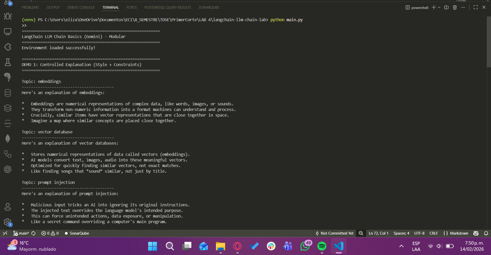
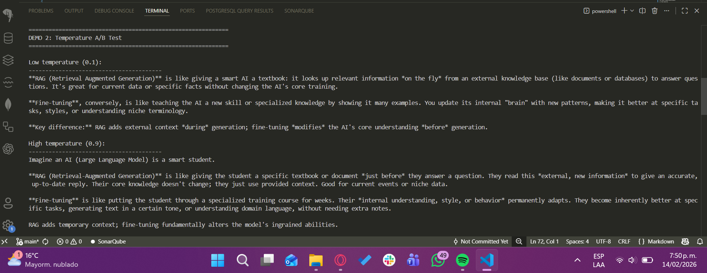
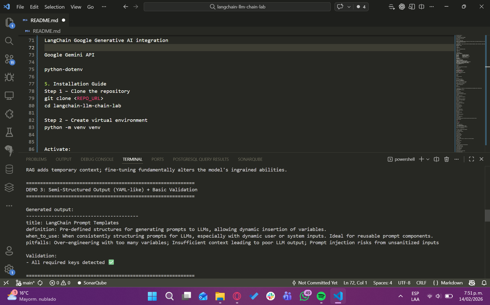
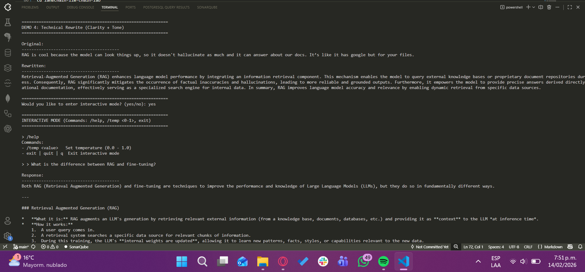
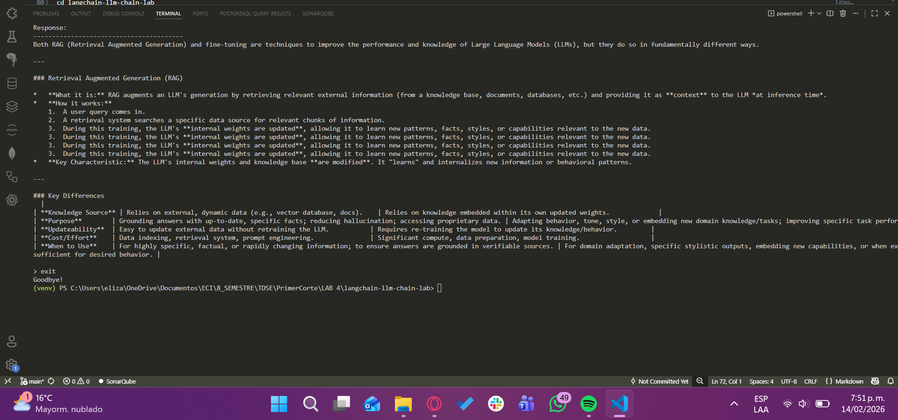

# LangChain LLM Chain Basics (Gemini)

**Author:** `Elizabeth Correa Suarez`  


---

## 1. Project Overview

This repository demonstrates the fundamental concepts of the **LangChain framework** using **Google Gemini** as the Large Language Model (LLM).

### Focus Areas

- Prompt engineering
- LCEL (LangChain Expression Language)
- Modular LLM chain construction
- Output parsing
- Interactive execution loop

> **Goal:** Understand how a basic LLM pipeline works before moving to more advanced architectures such as Agents or Retrieval-Augmented Generation (RAG).

---

## 2. Architecture

The project follows a **modular layered architecture** separating configuration, model initialization, prompt design, chain composition, and execution logic.

### Architectural Diagram

```
┌─────────────────┐
│   User Input    │
└────────┬────────┘
         │
         ▼
┌─────────────────┐
│ PromptTemplate  │
└────────┬────────┘
         │
         ▼
┌─────────────────┐
│  Gemini LLM     │
│ (ChatGoogle...) │
└────────┬────────┘
         │
         ▼
┌─────────────────┐
│ StrOutputParser │
└────────┬────────┘
         │
         ▼
┌─────────────────┐
│ Console Output  │
└─────────────────┘
```

---

## 3. Project Structure

```
langchain-llm-chain-lab/
│
├── chains/              # LCEL chain construction
├── config/              # Environment configuration
├── demos/               # Demonstration modules
├── llm/                 # Gemini model initialization
├── prompts/             # Prompt templates
├── images/              # Screenshots and diagrams
│
├── main.py              # Application entry point
├── requirements.txt     # Python dependencies
├── .env                 # Environment variables (not tracked)
└── README.md            # Project documentation
```

### Component Responsibilities

| Folder/File              | Responsibility                                    |
|--------------------------|---------------------------------------------------|
| `config/env.py`          | Loads environment variables                       |
| `llm/gemini.py`          | Initializes the Gemini LLM                        |
| `prompts/templates.py`   | Defines reusable PromptTemplates                  |
| `chains/factory.py`      | Builds LCEL chains (prompt \| llm \| parser)      |
| `demos/`                 | Contains independent demonstration modules        |
| `main.py`                | Orchestrates execution                            |

---

## 4. Technologies Used

| Technology                          | Purpose                                  |
|-------------------------------------|------------------------------------------|
| Python 3.11+                        | Programming language                     |
| LangChain                           | LLM framework                            |
| LangChain Google Generative AI      | Gemini integration                       |
| Google Gemini API                   | Large Language Model                     |
| python-dotenv                       | Environment variable management          |

---

## 5. Installation Guide

### Step 1 – Clone the repository

```bash
git clone <REPO_URL>
cd langchain-llm-chain-lab
```

### Step 2 – Create virtual environment

```bash
python -m venv venv
```

**Activate:**

- **Windows:**
  ```bash
  venv\Scripts\activate
  ```

- **Mac/Linux:**
  ```bash
  source venv/bin/activate
  ```

### Step 3 – Install dependencies

```bash
pip install -r requirements.txt
```

### Step 4 – Configure environment variables

Create a `.env` file in the project root:

```env
GOOGLE_API_KEY=your_api_key_here
```

---

## 6. Running the Application

Execute the main application:

```bash
python main.py
```

The application will sequentially run multiple demonstrations and optionally enter interactive mode.

---

## 7. Demonstrations

### Demo 1 – Controlled Explanation

**Demonstrates:**
- Prompt constraints
- Controlled output formatting
- Low temperature deterministic behavior



---

### Demo 2 – Temperature A/B Comparison

**Demonstrates:**
- Impact of temperature on generation
- Deterministic vs creative outputs



---

### Demo 3 – Semi-Structured Output

**Demonstrates:**
- Structured prompting
- Output validation logic
- Format enforcement



---

### Demo 4 – Technical Rewrite

**Demonstrates:**
- Prompt-based rewriting
- Tone control
- Constraint-based generation





---

## 8. Key Concepts Demonstrated

### 8.1 LCEL (LangChain Expression Language)

Chains are built using **operator composition**:

```python
chain = prompt | llm | StrOutputParser()
```

This creates a reusable execution pipeline.

---

### 8.2 Prompt Engineering

Different demos illustrate:

| Technique                | Description                                    |
|--------------------------|------------------------------------------------|
| Style control            | Control output tone and style                  |
| Output constraints       | Limit response format and length               |
| Structured formatting    | Enforce specific output structures             |
| Temperature effects      | Control randomness vs determinism              |
| Rewriting tasks          | Transform content with specific instructions   |

---

### 8.3 Modular Design

Instead of placing all logic in a single file, the project separates:

1. **Configuration** - Environment and settings
2. **Model initialization** - LLM setup
3. **Prompt design** - Template creation
4. **Chain construction** - LCEL pipeline
5. **Execution logic** - Demo orchestration

This improves **scalability** and **maintainability**.

---

## 9. Example Execution Flow

```
1. Load environment variables
          ↓
2. Initialize Gemini LLM
          ↓
3. Create PromptTemplate
          ↓
4. Build LCEL chain
          ↓
5. Invoke chain with structured input
          ↓
6. Parse and display output
```

---

## 10. Conclusion

This project establishes a solid foundation in:

- LLM pipeline construction
- Prompt engineering techniques
- Modular architecture in LangChain
- Interactive runtime execution


---

